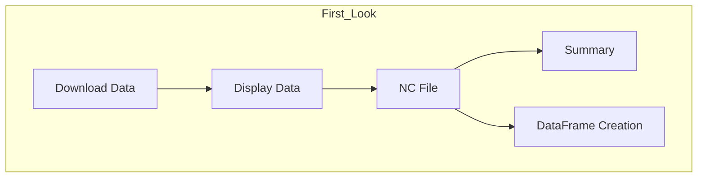
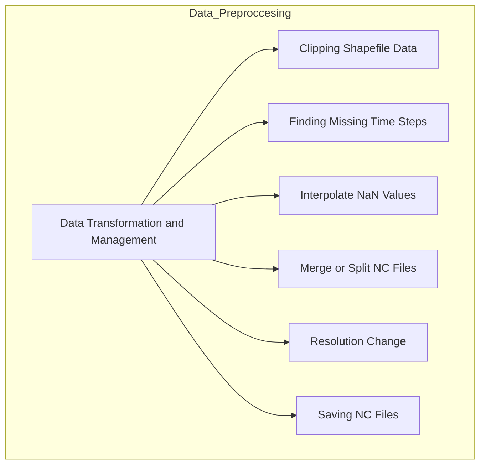
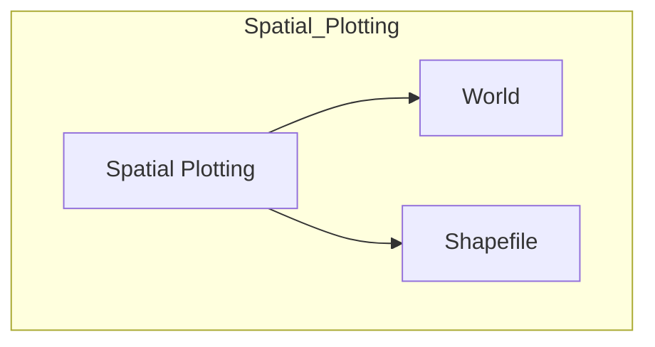
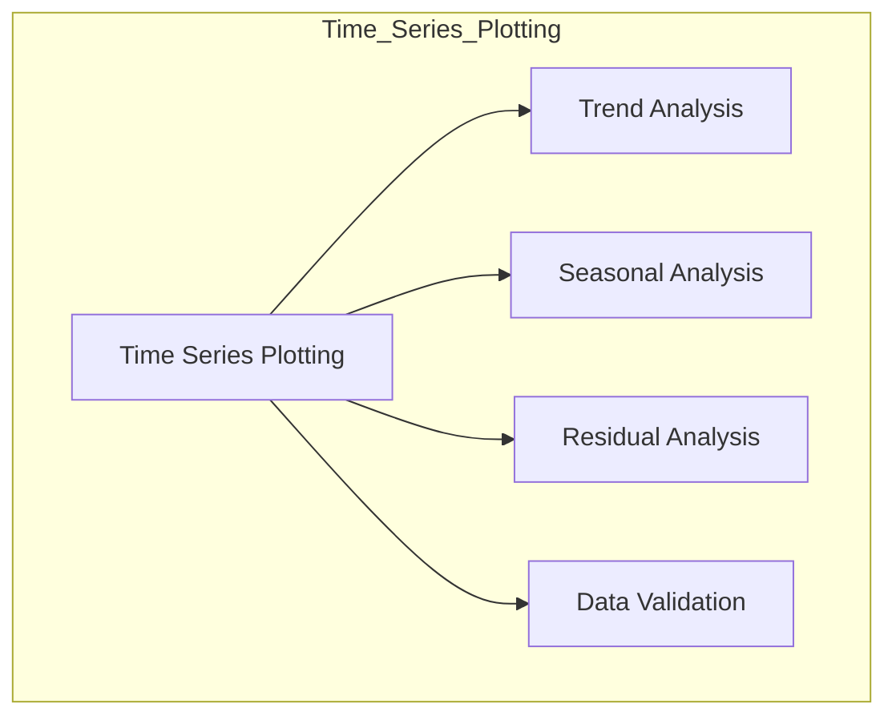

# PyPackage

[](https://www.python.org/downloads/release/python-380/)
[](https://colab.research.google.com/github/ronikianji/PyPackage)
[](https://opensource.org/licenses/MIT)

A comprehensive toolbox for performing advanced hydrological analysis, including data preprocessing, statistical calculations, and visualizations. 
This repository contains Jupyter Notebooks organized into folders and subfolders for modular hydrological tasks.

## Table of Contents
- [Installation](#installation)

## Installation
1.To run the code on your local machine, install JupyterLab by running:
```bash
pip install jupyterlab
```
2.Clone this repository: 
```bash
git clone (https://github.com/ronikianji/PyPackage.git)
```
3.Install the required dependencies:
```bash
pip install -r requirements.txt
```

# Folder Structure




    
```
