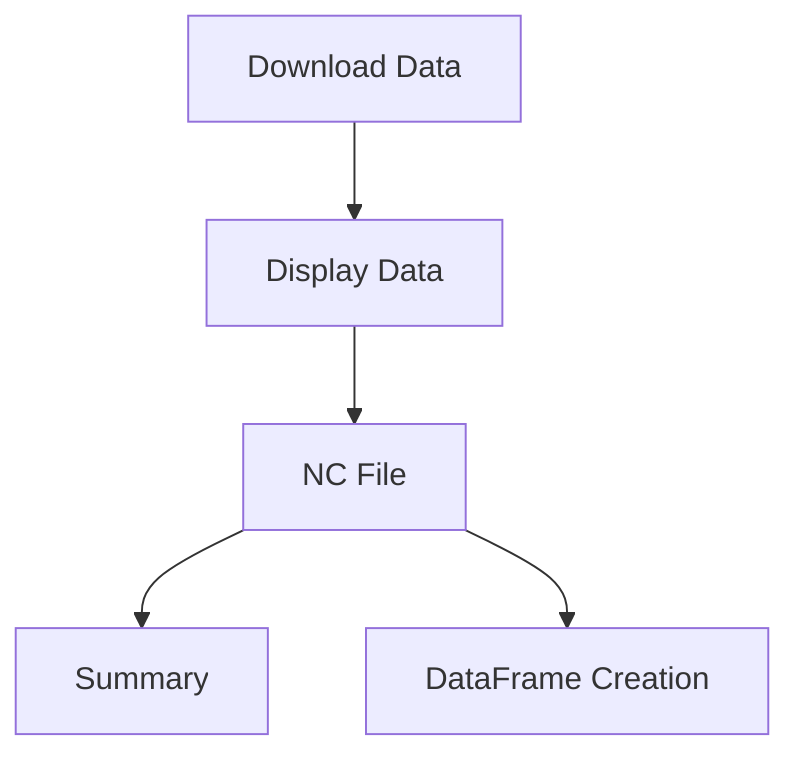
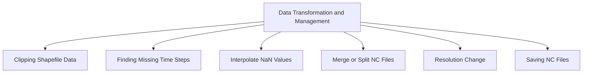
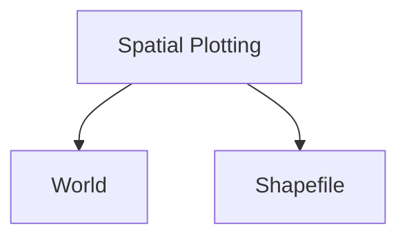
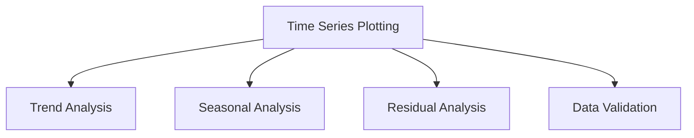

# WATcycle

[](https://www.python.org/downloads/release/python-380/)
[](https://colab.research.google.com/github/ronikianji/WATcycle)
[](https://github.com/ronikianji/WATcycle/blob/1338c4fb71dde76a90d6fe632918d0dcc35b1b5c/LICENSE)

A comprehensive toolbox for performing advanced hydrological analysis, including data preprocessing, statistical calculations, and visualizations. 
This repository contains Jupyter Notebooks organized into folders and subfolders. The development of such resource is intended to enable users in conducting
their hydrological research and related activities.

## Table of Contents
- [Installation](#installation)
- [Folder Structure](#folder-structure)
- [Contributors](#contributors)
- [License](#license)

## Installation
1. To run the code on your local machine, install JupyterLab by running:
```bash
pip install jupyterlab
```
2. Clone this repository: 
```bash
git clone (https://github.com/ronikianji/WATcycle.git)
```
3. Creating virtual environment
```bash
pip install virtualenv
python -m venv myenv
myenv\Scripts\activate 
pip install -r requirements.txt
pip install ipykernel
python -m ipykernel install --user --name=myenv --display-name "WATcycle"
```

## Folder Structure





## Contributors
This toolbox is designed to support hydrological analysis. Contributions are welcome to improve the toolbox, add new features, or enhance its functionality for the hydrological community. 
Your feedback and involvement are highly appreciated, and we thank all those who have contributed or plan to contribute in the future.

## License
This project is licensed under the MIT License. You can use, modify, and distribute it as long as you include the original license in your copies. 
Use this DOI for citation: [DOI: [DOI here]]
